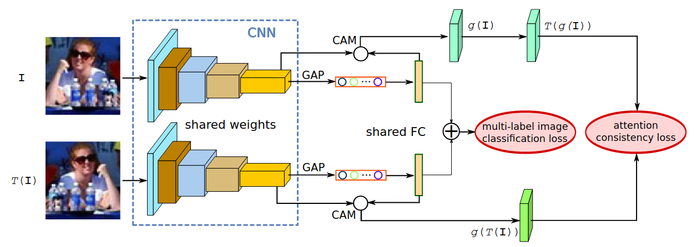

# Multi Label Detection

List of publications on Multi Label Detection

## Combining Metric Learning and Attention Heads For Accurate and Efficient Multilabel Image Classification

### [Paper](https://arxiv.org/pdf/2209.06585v2.pdf) | [Repo](https://github.com/openvinotoolkit/deep-object-reid)

### Abstract

[...] In our training strategy, instead of Asymmetric Loss (ASL), which is the de-facto standard for multilabel classification, we introduce its metric learning modification. In each binary classification sub-problem it operates with L2 normalized feature vectors coming from a backbone and enforces angles between the normalized representations of positive and negative samples to be as large as possible. [...]

### Architecture

## Visual Attention Consistency under Image Transforms for Multi-Label Image Classification

### [Paper](https://openaccess.thecvf.com/content_CVPR_2019/papers/Guo_Visual_Attention_Consistency_Under_Image_Transforms_for_Multi-Label_Image_Classification_CVPR_2019_paper.pdf) | [Repo](https://github.com/QData/C-Tran)

### Abstract

[...], we propose a two-branch network with an original image and its transformed image as inputs and introduce a new attention consistency loss that measures the attention heatmap consistency between two branches. This new loss is then combined with multi-label image classification loss for network training. [...]

### Architecture

## Residual Attention: A Simple but Effective Method for Multi-Label Recognition

### [Paper](https://arxiv.org/pdf/2108.02456v2.pdf) | [Repo](https://github.com/Kevinz-code/CSRA)

### Abstract

[...] To effectively capture different spatial regions occupied by objects from different categories, we propose an embarrassingly simple module, named class-specific residual attention (CSRA). CSRA generates class-specific features for every category by proposing a simple spatial attention score, and then combines it with the class-agnostic average pooling feature. [...]

### Architecture

## Multi-Label Learning from Single Positive Labels

### [Paper](https://arxiv.org/pdf/2106.09708v2.pdf) | [Repo](https://github.com/elijahcole/single-positive-multi-label)

### Abstract

[...], training sets will have only one positive label per image and no confirmed negatives. We explore this special case of learning from missing labels across four different multi-label image classification datasets for both linear classifiers and end-to-end fine-tuned deep networks. We extend existing multi-label losses to this setting and propose novel variants that constrain the number of expected positive labels during training. [...]

### Proposed Method

This paper focuses on the effect of false negatives in a dataset. Conventionally, all unlabeled data samples are assumed to be negative. Therefore, leaving labels out results in false negatives, which impact overall performance. Four methods are proposed to weigh down the effect of false negatives: 

1. weak negatives
2. label smoothing
3. expected positive regularization
4. online label estimation 

(*e.g.* If the labels for an image are given as **car**,**truck**,**minibus**, but there is an unlabeled **pedestrian** in the scene, the model will learn, that there is no pedestrian in the scene. Relaxing the statement, that there is no **pedestrian** in the scene will improve the networks performance on partially labeled data.)